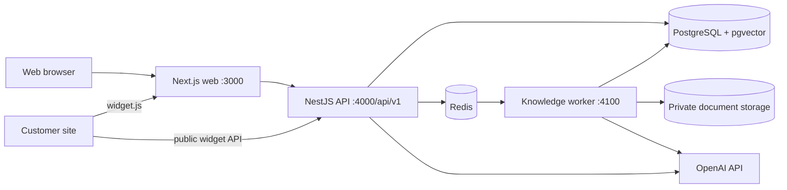

# ResolveAI deployment runbook

This repository is prepared for a production deployment but this document does not perform one. Production must inject secrets through the host, secret manager, or CI environment; never copy `.env` or `.env.production` into an image.

## Architecture



## Services and ports

| Service | Container port | Purpose |
| --- | ---: | --- |
| web | 3000 | Next.js application and `/widget.js` |
| api | 4000 | REST API, health, readiness, Swagger |
| worker | 4100 | Optional worker health/readiness server; BullMQ consumer |
| postgres | 5432 internal | PostgreSQL with pgvector |
| redis | 6379 internal | BullMQ queues and coordination |

Only web and API should normally be exposed through the reverse proxy. PostgreSQL and Redis remain on the private Compose network.

## Configuration

Copy `.env.example` to a secret-managed production environment file and replace every placeholder. The API and worker call typed startup validation. Production startup fails if JWT secrets are weak, URLs are localhost or non-HTTPS, secure cookies are disabled, OpenAI is missing, or selected S3/Stripe/SMTP settings are incomplete.

Important values include:

- `WEB_URL`, `PUBLIC_API_URL`, `NEXT_PUBLIC_API_URL`, and `WIDGET_SCRIPT_URL` must use the public HTTPS origins.
- `CORS_ALLOWED_ORIGINS` is a comma-separated exact-origin list for the dashboard. Public widget requests still pass the widget’s exact allowed-domain check.
- `DATABASE_URL` and `REDIS_URL` must be reachable from the container network.
- `OPENAI_API_KEY` remains backend-only and is never prefixed with `NEXT_PUBLIC_`.
- `STORAGE_PROVIDER=local` is for development or a single durable host. Use an S3-compatible private bucket before horizontally scaling API/worker replicas.

## Build and migration sequence

The supported package manager is the version pinned by the root `package.json` (`pnpm@9.15.0`). From a clean checkout:

```sh
corepack enable
pnpm install --frozen-lockfile
pnpm --filter @resolveai/database generate
pnpm --filter @resolveai/database migrate:status
pnpm --filter @resolveai/database migrate:deploy
pnpm build
```

Run `migrate:deploy` once as a release job or the Compose `migrate` one-shot service. Do not run `prisma migrate dev` or `prisma db push` in production, and do not let every API replica migrate on startup.

## Docker Compose

Local infrastructure remains:

```sh
docker compose up -d
```

The production-like definition is `docker-compose.production.yml`. It uses persistent named volumes, private database/Redis networking, health checks, restart policies, bounded JSON logs, a one-shot migration service, and non-root application containers.

```sh
docker compose -f docker-compose.production.yml build
docker compose -f docker-compose.production.yml run --rm migrate
docker compose -f docker-compose.production.yml up -d postgres redis api worker web
```

Before a real rollout, create `.env.production` outside Git and verify its permissions. The Compose file references it but it is intentionally not included in the repository.

## Health and readiness

- `GET /api/v1/health` is a lightweight process liveness check.
- `GET /api/v1/health/ready` checks PostgreSQL and Redis and returns HTTP 503 with only dependency status names when degraded.
- Worker `GET /health` and `GET /ready` are available on `WORKER_PORT` when the worker is running.
- Web hosting should use `/` or a platform-native health check.

Responses contain no credentials, hostnames, stack traces, or provider secrets. API responses include an `X-Request-Id` header and controlled error bodies.

## Logging and observability

Production API request logs are JSON with service, environment, request ID, method, route, status, and latency. Worker and knowledge events remain structured JSON. Development API request logs are readable text. Logs must never include authorization headers, cookies, JWTs, widget session tokens, API keys, passwords, document contents, or private prompts.

Forward request IDs from the web/API client when integrating additional services. Preserve them in incident reports without including request credentials.

## Storage and scaling

The current storage interface safely scopes local paths and rejects traversal. Local storage is not shared between replicas; it must be on durable storage for a single host and should be replaced with a private S3-compatible implementation before multiple workers or API replicas are used. Object keys must remain workspace-scoped and private; expose documents through authenticated or signed access only.

The worker uses BullMQ retries with exponential backoff, bounded concurrency, idempotent document writes, safe failure categories, interrupted-job recovery, and graceful shutdown. Monitor failed jobs and Redis memory. Set worker concurrency and job retention according to workload.

## Backups and rollback

Take a PostgreSQL backup and verify restore before every migration with material schema impact. Keep pgvector-compatible PostgreSQL backups and retain Redis only as a rebuildable queue/cache. Migrations are forward-only unless a tested compensating migration exists; application rollback may require a compatible previous image and database schema. Never delete production volumes during rollback.

## Deployment checklist

1. Build and scan web, API, and worker images.
2. Validate production environment values without printing them.
3. Confirm PostgreSQL backup and restore procedure.
4. Confirm database and Redis health checks.
5. Run `migrate:status`, then the one-shot `migrate:deploy` release job.
6. Start worker and API; wait for readiness.
7. Start web with the public API URL baked into the Next.js build.
8. Verify login, dashboard, knowledge processing, grounded answers, widget config/conversation, inbox, analytics, and billing.
9. Inspect logs for request IDs and confirm no secrets or development stack traces.
10. Roll back the image only if schema compatibility is confirmed.

## Secret rotation

Rotate OpenAI, database, Redis, JWT, SMTP, and billing credentials through the secret manager. Rotate JWT secrets with a planned session invalidation window. Never put backend secrets in frontend environment variables or rebuild artifacts.

## Current limitations

- S3-compatible storage configuration is prepared but the provider implementation remains local-only.
- Billing currently uses the existing mock provider unless the Stripe integration is completed separately.
- Worker readiness is an HTTP health server, not a separate orchestration control plane.
- CI validates the Prisma schema and application checks; it does not perform live provider calls or deployment.
